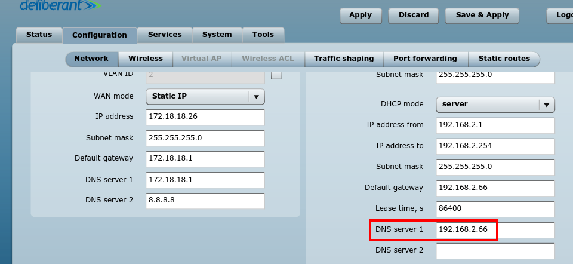

This post is only for educational purposes and use the workaround described here at your own risk !

Though I have a premium account with my broadband provider and I can browse the internet by logging in. But out of curiosity, I am always searching for a workout through which I can avoid the login part and use the internet off the records. This situation is pretty common. You find yourself at places like public Wi-Fi zones, McDonalds, Hotel Rooms etc. with your Wi-Fi card detecting open networks. You immediately jump on to connect to it and fire a URL into your browser and Er? What's this:

A login screen appears no matter what URL you try to access. These are called as [Captive Portals](https://en.wikipedia.org/wiki/Captive_portal). What you can do now ? Spend a few bucks ? :sweat: Eh, can't I bypass this? And, the answer is yes :wink: 

The whole process breaks down to the following steps:

- Check how vulnerable your network is
- Appying the hack

 

## Vulnerability testing
 
I have a wireless broadband connection. The wireless signal is captured by an [APC propeller](https://www.deliberant.com/apc-propeller-5) and then I am provided with an ethernet cable to plug into my machine. The APC is generally provided after **factory reset** and serves as a router itself. 
I logged off my user account and made the following observations:

I cannot ping a webserver.

$ ping example.com
PING example.com (93.184.216.34) 56(84) bytes of data.
From 103.206.248.193 icmp_seq=1 Destination Net Prohibited
From 103.206.248.193 icmp_seq=2 Destination Net Prohibited
From 103.206.248.193 icmp_seq=3 Destination Net Prohibited

Here one thing you should notice that the reply 
is from `103.206.248.193`. This is the [DNS Server](https://en.wikipedia.org/wiki/Name_server) used by my broadband provider. I tried pinging the same but no avail. The DNS queries are **fowarded** by another *server*. Now I need to find this *mysterious server*. So, one thing is sure for now, [ICMP](https://en.wikipedia.org/wiki/Internet_Control_Message_Protocol) packet transmission is not allowed. So, I cannot do ICMP tunneling.

I further tried resolving a domain name and it worked like charm. Note that *pinging* and *resolving* are not the same things !


$ nslookup example.com
Server:     127.0.1.1
Address:    127.0.1.1#53

Non-authoritative answer:
Name:   example.com
Address: 93.184.216.34


Now, you should know that the [DNS](https://en.wikipedia.org/wiki/Domain_Name_System) protocol runs over the [UDP](https://en.wikipedia.org/wiki/User_Datagram_Protocol) protocol. So, I suspected that **maybe** UDP packets transmission is allowed since DNS is resolving fine. So, I used `netcat` to run a echo check over an [VPN](https://en.wikipedia.org/wiki/Virtual_private_network) server running over UDP(port 53).


$ echo -e "\x38\x01\x00\x00\x00\x00\x00\x00\x00" | timeout 10 nc -u 176.126.237.217 53 | cat -v
# No-response


Eish ? UDP packets are also blocked too. So, I cannot connect to a VPN service running over UDP :/ So, here we are cut with the options. But wait, we can still resolve DNS queries, hell yeah ! So, we need to find a way to craft the DNS query packets to carry the [TCP](https://en.wikipedia.org/wiki/Transmission_Control_Protocol) payload (which is blocked by default). And, this evil *abuse* of the DNS protocol is called as **DNS Tunneling** It's not evil for us, though :wink:

### Finding the *mysterious server*
 
Well, this step is not required for establishing the tunnel. But there is no harm in finding it. This can be easily found by doing a newtork scan by `arp-scan` tool. 


$ arp-scan -I eth0 --localnet
Interface: eth0, datalink type: EN10MB (Ethernet)
Starting arp-scan 1.8.1 with 256 hosts (http://www.nta-monitor.com/tools/arp-scan/)
192.168.2.66    00:19:3b:08:78:b6   Wilibox Deliberant Group LLC

1 packets received by filter, 0 packets dropped by kernel
Ending arp-scan 1.8.1: 256 hosts scanned in 1.384 seconds (184.97 hosts/sec). 1 responded

 
You can see `192.168.2.66` is on the network and it's the APC router(in your case this may be any other router) which is indicated by the manufacturer details. Just to make sure it is, I logged into its admin interface using the default credentials by checking the manufacturer website. As I said earlier they did a factory reset of the APC. In my case, as the manufacturer is [Deliberant](http://deliberant.com) and the default credentials are known to be `admin:admin01`. And, the following confirms it:

 

## Applying the hack
 
Personally, I don't like the term hack ! but I'll cope with it ;) For doing DNS tunneling, you need to understand how this is going to work. So, basically when you browse the internet you *request* info and a *response* is provided to you. But here I can make only *DNS requests*, neither *TCP*, *UDP*, *ICMP* etc.
Under the hood, I need to *hide* the request payload into DNS packets.

- I will craft a DNS packet carrying *request* payload and send it.
- A DNS server will *decode* this payload for me, fetch the *response* and *encode* it back to the DNS packet and finally return the packet. 

 
Astonishing, isn't it ? It will be appear as we are making only DNS queries to the middle parties as we are encapsulating things in a canny way. Probably now, you must have sensed that we need someone on the other end to answer these *crafted DNS queries* for us, yeah we need our own *DNS server* !

### Setup requirements

- A registered domain. In my case, I will be using : `black-perl.in`. You can register a free domain with services like [dot.tk](http://www.dot.tk/) etc.
- A server with a public IP not running any DNS services ( check that port `53` ). I am using [Digital Ocean](https://www.digitalocean.com/) for this, and this is my referral [link](https://m.do.co/c/8c7957d9515d), in case your'e interested in setting up one for you !
 
 

Now, you should know the basics of [Domain Management](https://blog.hubspot.com/insiders/domain-name-management) and types of [DNS records](http://www.pcnames.com/articles/what-are-dns-records). Google a bit, and come back here later on ! We will be needing a [subdomain](https://en.wikipedia.org/wiki/Subdomain) delegated to our nameserver. Let's set this up:

-  In my case the subdomain is `hack.black-perl.in` and the nameserver domain is `dns.black-perl.in`. 
-  Add an `A record` for `dns.black-perl.in` to point to your public server IP address.
-  Add a `NS record` for subzone `hack.black-perl.in` pointing to `dns.black-perl.in`.

 
What it means? If somebody query for `<some-string>.hack.black-perl.in` , then these queries are answered by our *canning* nameserver `dns.black-perl.in`.

Let's move forward, we talked about encoding/decoding payloads. It's PITA to implement this functionality, but we won't! There's a piece of open source software out there called as [Iodine](https://github.com/yarrick/iodine). We need to do the following:

- #### Server end : 


$ iodined -f -c -P pass -n <server-ip> 10.0.0.1 hack.black-perl.in


Pass in your server IP and subdomain created earlier.
Here, `-f` makes the Iodine server to run in foreground and  `-P` is used to provide a password string that the client is going to provide while connecting. `10.0.0.1` is the other end of the tunnel interface to be created. The client(our machine) will be having `10.0.0.2` as it's IP Address.

- ### Client end:


$ iodine -f -P pass 192.168.2.66 hack.black-perl.in
   .  .
   .  .
   .  .
  Connection setup complete, transmitting data.


You can skip `192.168.2.66` (mysterious server we found before) from the above command. This is basically the DNS we are tunneling through. You can use `8.8.8.8` (Google's DNS) or something else. But, in my situation I am forced to use this DNS by my broadband provider and this will be automatically forced in case you skip it. Upon successful connection, run `ifconfig` and you will observe a tunnel `dns0` is created.


dns0      Link encap:UNSPEC  HWaddr 00-00-00-00-00-00-00-00-00-00-00-00-00-00-00-00
          inet addr:10.0.0.2  P-t-P:10.0.0.2  Mask:255.255.255.224
          UP POINTOPOINT RUNNING NOARP MULTICAST  MTU:1130  Metric:1
          RX packets:0 errors:0 dropped:0 overruns:0 frame:0
          TX packets:0 errors:0 dropped:0 overruns:0 carrier:0
          collisions:0 txqueuelen:500
          RX bytes:0 (0.0 B)  TX bytes:0 (0.0 B)


Now, let's create a [SOCKS](https://en.wikipedia.org/wiki/SOCKS) proxy for using this tunnel.

$ ssh -D 8080 user@10.0.0.1


The `user` refers to your `server user` and our server IP is aliased as `10.0.0.1` due to the establishment of `dns0` tunnel.
Now, set the proxy to be `127.0.0.1` with port `8080` and type `Socks5` and viola ! you are done.

**Note:** Some of the above commands are required to be run using `sudo` , i.e you require **root** privileges. I omitted it to keep things less verbose. The speed obtained is very less and these type of connections can mostly be used to open a SSH connection or browsing text based sites. I myself get around `5 KBps` speed and managed to open the [website](http://geohot.com) of the IPhone jailbreak inventor guy George Hotz.