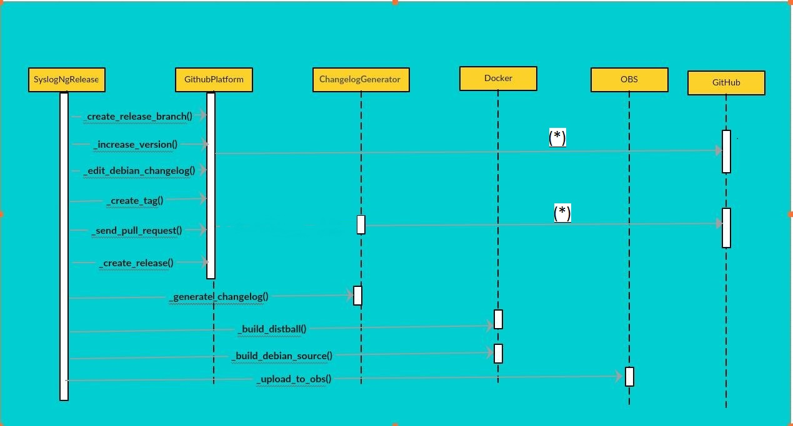

*Controlling complexity is the essence of computer programming.
(Brian Kernigan)*

Let me remind you, I have been working with [Syslog-Ng](https://syslog-ng.org/) on their release automation project as part of [GSoC'16](https://summerofcode.withgoogle.com). You can get more information about the project by lurking over [here](http://black-perl.in/black-perl-gsoc-with-syslog-ng/) I will try to summarize my experiences during GSoC'16 and the deliverables.

## Breaking down the project
syslog-ng is hosted at [Github](https://github.com/balabit/syslog-ng) and does releases using the [Github Releases](https://github.com/blog/1547-release-your-software). The underlying algorithm I used for the release automation follows:

- Clone the repository and generate a [changelog](https://changelog.com/) using a **changelog generation algorithm**. This is probably the toughest and most time consuming part.

- Create a `release` branch from the `master` and add commits to the branch doing version increments.

- syslog-ng has a rich set of dependencies and building of `distribution tarball` has to be done in a [docker](https://www.docker.com) environment.

- After generation of the distribution tarball; a `debian source package` is generated using the previously generated distribution tarball.

- The debian source package is then uploaded to [OBS](http://build.opensuse.org) for generating the debian packages for different linux distributions.

- After successful generation of the distribution tarball, a release [tag](https://git-scm.com/book/en/v2/Git-Basics-Tagging) is created and a [release](https://github.com/balabit/syslog-ng/releases) is generated on Github using the previously generated release tag and generated changelog.

- A [pull request](https://help.github.com/articles/using-pull-requests/) is then sent to the `master` branch from the `release` branch and the release process is said to be complete.

The Sequence Diagram describes the project structure:




** (*) Indicates multiple methods **

## Deliverables
I created [syslog-ng-autorel](https://github.com/black-perl/syslog-ng-autorel/tree/test) for providing the above functionality. The `README.md` file has the usage instructions. Go! get your hands dirty with it :smile:

## Challenges and Roadblocks
I encountered lot of roadblocks during the project and some away from the computer world too. I suffered a full body infection that effected my senses. At one point, it became very difficult to cope with things and I was thinking to leave the project. Thanks to my awesome mentors, [Laszlo Budai](https://www.facebook.com/laszlo.budai.9822) and [Laszlo Varady](https://www.facebook.com/MrAnno). They let me take some time off and were more than supportive.
Coming back to the project, these are the roadblocks I would like to highlight:

- ### Architecture
    I was pretty fast at implementing things but I always have the habit of making a mess of the architecture. As they say, *Understand the underlying business logic and abstraction first and then start implementing*
    <br/>
    <br/>
    Without digging into the architectural aspects, I preferred jumping directly into implementations. This technique has many pain points. As you get to understand the architectural aspects over time, your code suffers heavy refactoring. Moreover, your mentors need to step up into your code trying to figure out what's going on. And then, Er? Eh! What? No.
    <br/>
    <br/>
    We must understand that they don't have all the time in the world and have full time jobs too. So, having a blue print before hand is crucial. It kicks the code refactoring aspect out of picture serving us students well and at the same time saves time of our mentors too.We can take the help of [Sequence Diagrams](https://en.wikipedia.org/wiki/Sequence_diagram), [UML Diagrams](https://en.wikipedia.org/wiki/Unified_Modeling_Language) etc. to communicate to mentors our ideas about architecture and at the same time take feedback. It's a true [Agile Software Development](https://en.wikipedia.org/wiki/Agile_software_development) process.
<br/>
<br/>

- ### SOLID Code:
     I come from a scripting background with very less experience in professional coding experience in compiled languages. In my opinion, one should write some code in programming languages like `JAVA`, `C++` etc. because they are more structured and gives you required exposure to practice writing [SOLID](https://en.wikipedia.org/wiki/SOLID_(object-oriented_design)) code. So, why SOLID ? SOLID principles let you mimic your architecture into implementation in a way that facilitates easy code refactoring, dependency changes in code etc. overtime. 

Here is the architectural design of my [changelog_generator](https://github.com/black-perl/syslog-ng-autorel/tree/test/autorel/changelog_generator) module. And, it feels great when you implement it using the SOLID principles. Thanks, [Laszlo Varady](https://www.facebook.com/MrAnno) for this.


- ### Changelog Generation:
    Changelog generation is the process of generating detailed log between two releases incorporating the **merged pull requests**, **fixed issues**, **bugs**, **enhancements** etc. Why changelog, go [here](http://keepachangelog.com/en/0.3.0/). We need a changelog now :smile: I used the following algorithm for generating the changelog:
    - Find the list of commits between two releases.
    - syslog-ng enforces commit patterns. For eg.
         ```
         Merge pull request #1159 from lbudai/f/fix-elastic-mod-http-slf4j
         ```
         With the help of [regex](https://en.wikipedia.org/wiki/Regular_expression) we can have the list of all `pull request ids`. 
      Similarly, I can find the list of `merged branches`.
    - Some of these `pull requests` may be linked to `fixed issues`.I used a Python client library [Pygithub](https://github.com/PyGithub/PyGithub) for interacting with the [Github API](https://developer.github.com/v3/). So, the `linked issues` are found out.
    - For other issues we can parse the commit message:
        ```
         Fixed #416 queue full message
        ```
    - Classification of the issues is done into `bugs`, `enhancements` etc.
    - Finally we have four types of changelog entries:
        - `Bugs` 
        - `Enhancements`
        - `Merged Pull` ( Pull request not linked to an issue or a local checkout )
        - `Fixed Issue`( Uncategorized fixed issue )
    
    Finally, a changelog is generated carrying the contributor info for each changelog entry. You can see the output of the tool [here](https://gist.github.com/black-perl/3fc61c5034cf0b217d36b99c219ed710)
    
- ### OBS upload
    I was using `Python3` for development of the project. One of the task was to upload the Debian source package to OBS as I mentioned earlier. I tried using [osc](https://github.com/openSUSE/osc). It's own source code is return with backward compatibility and supports  `Python3` but one of the dependencies `m2crypto` is not Python3 compatible. This module is used to establish a SSL connection to OBS. So, I adopted a solution that involves spawning an independent `Python2` process for handling OBS upload.


## Learnings
Apart from adding some cool tool-chains to my arsenal, I found developing a good relationship with my mentors as the best experience of the GSoC project. I wouldn't have learned a single thing without their constant support. They are just awesome :smile: Let's get back to the new things I learned:

- Controlling docker with Python
- Practice of writing code with SOLID principles
- Knowledge of Debian packaging
- GIT internals and sound knowledge of Github
- I think I got better at System design/architecture


## Future Work
I am planning to work with syslog-ng in the coming months. The goal of the GSoC'16 project was to develop building blocks for the release pipeline of syslog-ng. Let's see if I can integrate these modules into a release pipeline. Apart from it, I am planning to create a web interface to provide analytics for the project.


Contributing to open source software is fun and it always will be. Keep digging and stay tuned !

`#happy_coding`